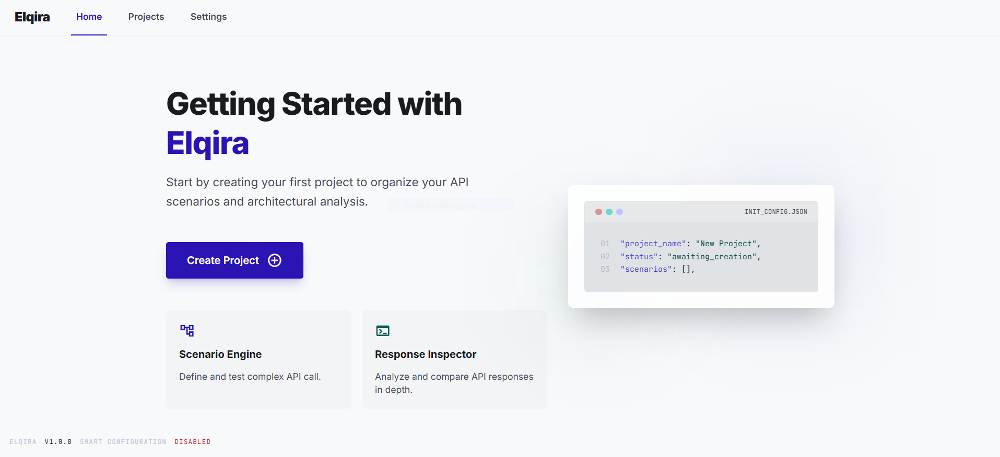
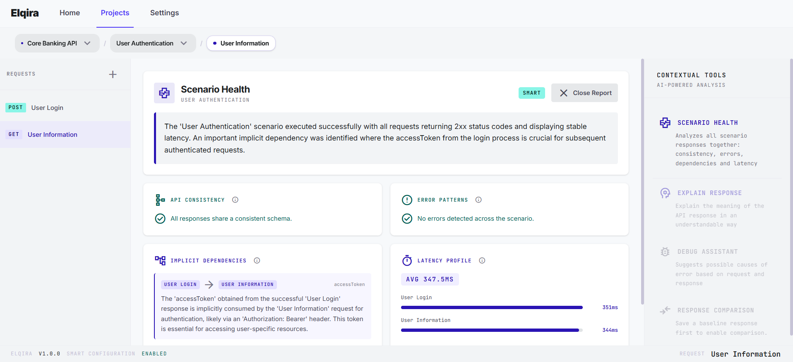

# Elqira

Elqira is a scenario-first tool for exploring and understanding API behavior.

Instead of treating each HTTP call as an isolated action, Elqira helps you organize your work around scenarios: meaningful groups of requests that represent a real use case, such as authentication, onboarding, or profile updates. The goal is not simply to send requests, but to make responses easier to read, compare, and reason about in context.

At the center of the experience is a simple structure:

`Project -> Scenario -> Request -> Response`

This makes it easier to move from a broad area of work to a specific API call while keeping the surrounding context visible.



## What You Can Do With Elqira

With Elqira you can:

- create projects and organize scenarios inside them
- build requests with method, URL, headers, query parameters, body, and notes
- execute requests and inspect responses in a readable way
- save a response as baseline and compare it with a later execution
- analyze a full scenario once every request in that scenario has been executed at least once

Elqira is now fully local-first. It does not send request or response data to external LLM providers. Analysis is generated directly inside the app using deterministic local logic.

Current analysis features include:

- **Scenario Health**: analyzes all executed requests in a scenario together and produces a structured health report that includes:
  - API consistency checks to detect schema mismatches, naming inconsistencies, or structural drift across responses
  - error pattern analysis to surface recurring failures such as `4xx`, `5xx`, timeouts, or network-level issues
  - implicit dependency detection to identify hidden data flows between requests, such as IDs or tokens generated by one call and required by another
  - latency profile insights showing average timing, slow requests, and the main bottleneck in the scenario flow
- **Explain Response**: summarizes the meaning of the current response, highlights key fields, and classifies transport and latency signals.
- **Debug Assistant**: analyzes failed responses and proposes likely causes and practical fixes.
- **Response Comparison**: compares a current response with a saved baseline and highlights structural or behavioral differences.
These features work without external AI configuration.



## Application Status & Data Handling

Elqira is currently under active development.

At the moment:

- application data (Projects, Scenarios, Requests, Settings) is stored in the browser's LocalStorage
- request execution and analysis run locally in the browser
- workspace data can be exported and imported as JSON

This storage model is temporary and may be replaced in the future with a more robust persistence strategy.

## Running the Project Locally

If you want to run Elqira locally, use Node.js `22.12.0`.

Install dependencies:

```bash
nvm use
npm install
```

### Web App

```bash
npm run dev:web
```

Build the web app:

```bash
npm run build
```

### Electron Desktop

Run Electron in development:

```bash
npm run dev
```

Package the desktop app for the current platform:

```bash
npm run build:electron
```

Build a Windows installer (`.exe` via NSIS):

```bash
npm run build:win
```

Build the unpacked Windows app directory without creating the installer:

```bash
npm run build:win:dir
```

The first Electron packaging run may need to download platform-specific binaries.

### WSL and Windows

If you are developing from WSL, use WSL for the web app workflow and run Electron or Windows packaging from a Windows terminal in a synchronized Windows copy of the project.

If you are packaging for Windows, the most reliable path is to run the build on Windows or in a Windows CI runner. The installer output will be generated under `dist/`.

To run the linter:

```bash
npm run lint
```

To preview the production build locally:

```bash
npm run preview
```

## Feature Requests

If you want to suggest a feature or propose an improvement, please open an issue in this repository.

## Security

If you discover a security vulnerability, do not open a public issue. Report it privately by email at `tommasosacramone.box@gmail.com`.

## License

This project is licensed under the [Apache License 2.0](./LICENSE).
