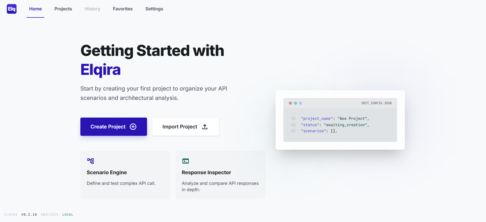
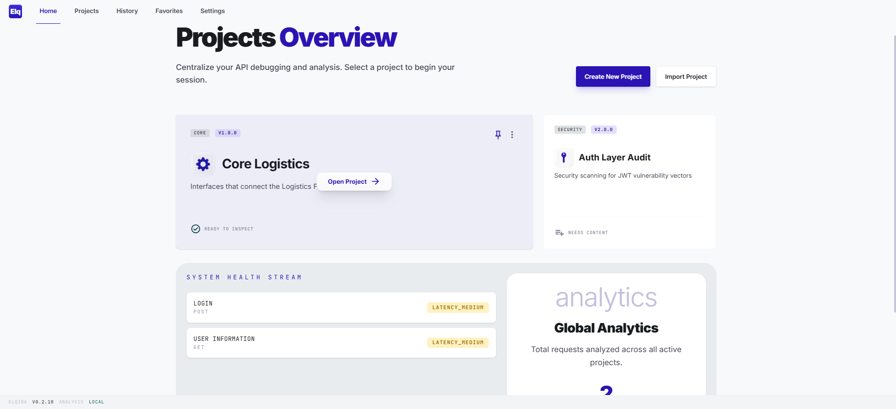
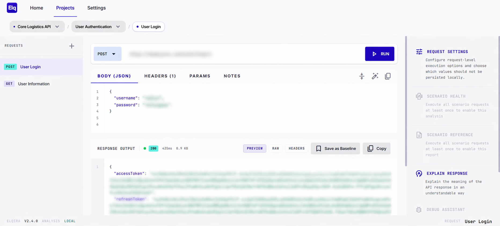
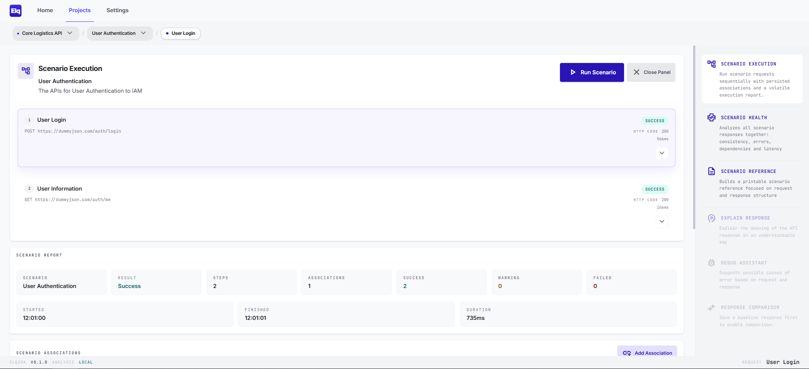
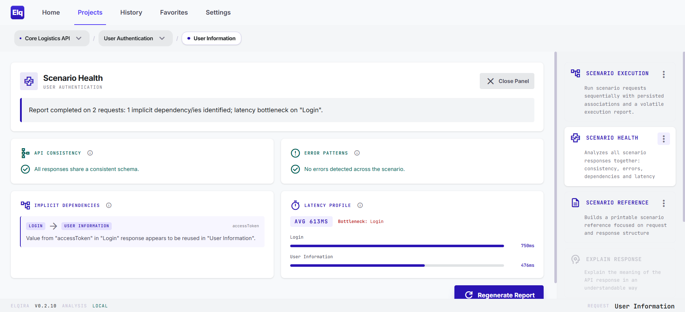
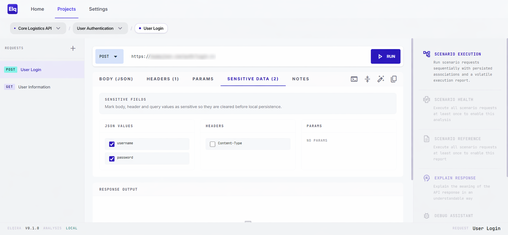

# Elqira

[](https://github.com/tommysack-box/elqira/blob/main/LICENSE)
[](https://github.com/tommysack-box/elqira/tags)
[](https://github.com/tommysack-box/elqira/releases/latest)

<div align="center">


</div>


Elqira is a scenario-first API workspace designed to help developers understand API behavior through connected request flows instead of isolated HTTP calls. Instead of treating each call as an isolated action, it helps you organize your work around scenarios: meaningful groups of requests that represent a real use case, such as authentication, onboarding, or profile updates. 

Elqira is not focused on sending requests in isolation. Its goal is to help developers understand how APIs behave together inside real application flows. At the center of the experience is a simple structure:  Project -> Scenario -> Request -> Response. 
This makes it easier to move from a broad area of work to a specific API call while keeping the surrounding context visible. 



## 🚀 How to Use Elqira

Elqira can be used in two different ways, depending on your workflow:

### 1. Local Web App (localhost)

You can run Elqira as a local web application in your browser.  
This is the simplest way to get started during development.

### 2. Desktop Application (Electron)

Elqira is also available as a desktop application built with Electron.

Prebuilt installers are available in the [Releases](https://github.com/tommysack-box/elqira/releases) section of this repository.

## 🧩 What You Can Do With Elqira


With Elqira you can:

- model real-world API interactions using Projects and Scenario-driven flows 

 

- define Requests with full control over method, URL, headers, query parameters, body, and contextual notes to preserve intent and context 

 

Elqira stores workspace data locally and does not send request or response data to external LLM providers. 
Analysis is generated directly inside the app using deterministic local logic.

Current analysis features include:

- **Scenario Execution**: executes a full scenario as a connected request flow, letting you define persisted associations between requests so values extracted from earlier responses can be injected into later steps. During a run, Elqira shows the scenario progressing step by step and generates a volatile execution report with overall outcome, timings, and per-step results for that flow.



- **Scenario Health**: analyzes all executed requests in a scenario together and produces a structured health report that includes:
  - API consistency checks to detect schema mismatches, naming inconsistencies, or structural drift across responses
  - error pattern analysis to surface recurring failures such as `4xx`, `5xx`, timeouts, or network-level issues
  - implicit dependency detection to identify hidden data flows between requests, such as IDs or tokens generated by one call and required by another
  - latency profile insights showing average timing, slow requests, and the main bottleneck in the scenario flow



- **Scenario Reference**: generates a scenario reference from executed requests, inferring request and response structure without exposing runtime payload values. The reference can be exported as `PDF`, `Markdown`, `YAML`, or `JSON`, making it useful for documenting endpoints, headers, query params, body schema, and response schema for an entire scenario in different formats.
- **Explain Response**: summarizes the meaning of the current response, highlights key fields, and classifies transport and latency signals.
- **Debug Assistant**: analyzes failed responses and proposes likely causes and practical fixes.
- **Response Comparison**: compares a current response with a saved baseline and highlights structural or behavioral differences.


## 📌 Project Status

**Elqira is currently under active development**

## 🔒 Security & Data Storage

Elqira is a web application with local workspace persistence.

At the moment:

- application data (Projects, Scenarios, Requests, Settings) is stored locally in the browser via IndexedDB
- request execution and analysis run locally in the browser
- workspace data can be exported and imported as JSON

This IndexedDB-based local storage model is temporary and may be replaced in the future with a more robust persistence strategy.

Local persistence in IndexedDB should not be considered encrypted secret storage. Data stored by the app remains protected only by the security of the local device, operating system account, and browser profile in which Elqira is running.

### Important security note

Because Elqira is an API client and stores workspace data locally in the browser, saved requests may contain sensitive information such as:

- API keys  
- Bearer tokens  
- Basic auth credentials  
- Custom headers  
- Request bodies containing personal or confidential data  

Anyone with access to the same device or browser profile may be able to access locally stored request data.

For this reason, **Elqira should not be considered a secure vault for secrets**.

At the moment, Elqira persists request workspace data locally, but it does not persist full response payloads as durable workspace records. Response content is available in the current session for inspection and analysis, but it should still be treated as sensitive while the app is open.

### Avoid persisting sensitive values with Sensitive Data

If a request contains sensitive data, you should use the **Sensitive Data** tab in the request workspace to prevent those values from being stored locally.

Elqira includes the **Sensitive Data** tab to help you avoid storing selected sensitive values in local IndexedDB persistence.

Inside the request workspace, open the **Sensitive Data** tab and mark the fields that should be treated as sensitive.

The feature currently works for:

- JSON body values
- request headers
- query parameters, including values reflected in the request URL



When a field is marked as sensitive:

- its value is cleared before the request is persisted locally
- the sensitivity metadata is kept, so the app still remembers which fields are sensitive
- the value is cleared again when the request is reopened

This helps reduce accidental local persistence of tokens, API keys, passwords, and other confidential request data while preserving the request structure.

Users are strongly encouraged to:

- avoid storing production credentials or long-lived tokens  
- use temporary or test credentials whenever possible  
- use the **Sensitive Data** tab for any header, body field, or query parameter that contains secrets or confidential values  
- review exported JSON files before sharing  

## 🔭 Future Development

Elqira is designed to remain useful without requiring external AI services, but an optional AI integration is planned for future versions.

The goal of this integration is to help users get more value from the analysis tools already present in the app, enabling richer interpretation, deeper debugging support, and more advanced scenario-level reasoning when AI-assisted workflows are explicitly enabled.

This capability is intended to be opt-in, so users will be able to decide whether to keep using the current local analysis model or connect AI features where they provide additional value.

## 🛠️ Development Notes

If you want to work on Elqira locally, use Node.js `22.12.0`.

Install dependencies:

```bash
nvm use
npm install
```

### Web App

```bash
npm run start
```

### Electron Desktop

Build a Windows installer (`.exe` via NSIS):

```bash
npm run build:win
```

### WSL and Windows

If you are developing from WSL, use WSL for the web app workflow and run Electron or Windows packaging from a Windows terminal in a synchronized Windows copy of the project.

If you are packaging for Windows, the most reliable path is to run the build on Windows or in a Windows CI runner. The installer output will be generated under `dist/`.

### Versioning and Tags

To create a new application version and the related git tag, use:

```bash
npm version patch
npm version minor
npm version major
```

These commands run the configured version lifecycle, including the project quality checks before the version bump (`lint`, `npm audit`) and the post-bump release preparation (`build:web`, automatic changelog update via `git-cliff`, and staging of the generated release files).

The changelog is generated from the git history. Commits that follow prefixes such as `feat:`, `fix:`, `docs:`, `refactor:`, `build:` and `chore:` are grouped more cleanly, while older or free-form commit messages still fall back to a generic `Changed` section.

- `feat:` introduces a user-visible feature or capability
- `fix:` corrects a bug or unintended behavior
- `docs:` updates documentation only
- `refactor:` restructures code without changing intended behavior
- `build:` changes build, packaging, or tooling behavior
- `chore:` covers maintenance work that does not fit the categories above

## 💡 Feature Requests

If you want to suggest a feature or propose an improvement, please open an issue in this repository.

## 🛡️ Security

If you discover a security vulnerability, do not open a public issue. Report it privately by email at `tommasosacramone.box@gmail.com`.

## 📄 License

This project is licensed under the [Apache License 2.0](./LICENSE).
Third-party software, libraries, and other redistributed components may be subject to separate license terms.
